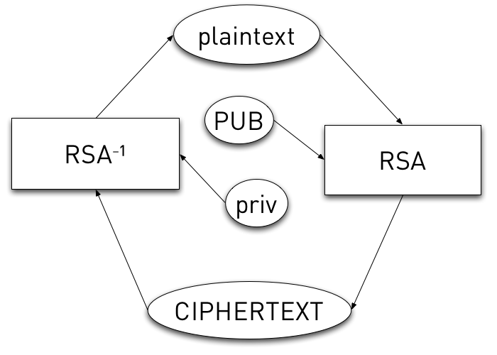

!SLIDE
# How does it encrypt? #

!SLIDE center

!SLIDE
# How does it really encrypt? #

!SLIDE
# Crazy, f&*$ed-up math #

!SLIDE code smbullets incremental
# Asymmetric Math #

* n = pq
* e = 0x10001 (frequently)
* d = e-1 mod phi(n)
* C = me mod n
* m = Cd mod n

!SLIDE
# BUT! #
## this only "works" for special values ##

!SLIDE
# (Some) RSA Requirements #

!SLIDE
# Size of message #
## me &gt; n ##

(stare at C = me mod n)

## solved with padding ##

!SLIDE
# Now you have a padding problem #
## Use OAEP, not just randomness ##

!SLIDE
# Size of message (again) #
## m < n ##

!SLIDE
# "Coppersmith's Attack" #
## solve by never sending same message to multiple people ##

!SLIDE smbullets incremental
# other craziness #

* p & q not "too" close
* *p - 1* or *q - 1* shouldn't have only small prime factors
* Wiener's Attack (small "d")
* Timing Attacks
* Adaptive Chosen Ciphertext Attack

!SLIDE smbullets incremental
# other craziness (cont'd) #

* Branch-Prediction Analysis
* Quantum Prime Factorization (not yet implemented)
* Small *n* == bad (use 2048, minimum!)

!SLIDE
# Moral #
## do **not** implement yourself! ##
