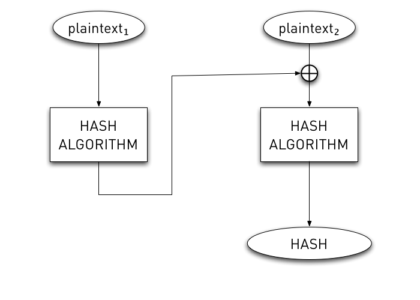
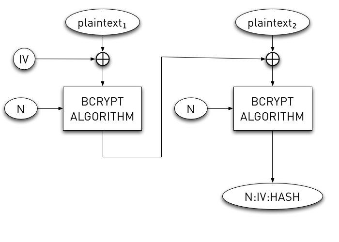

!SLIDE
# Hashing #

!SLIDE bullets incremental
# Hashes #

* MD5
* SHA1, SHA256
* Bcrypt
* HMAC-SHA

!SLIDE
# Traditional Hashes (MD5, SHA) #
## Provide little security against brute force ##

!SLIDE
# Salt does *NOT* Help #

!SLIDE
# Traditional Hash #

!SLIDE
# Bcrypt Hash #

!SLIDE
# Message Authentication Code #
## Verifies hash via key ##

!SLIDE
# HMAC #

