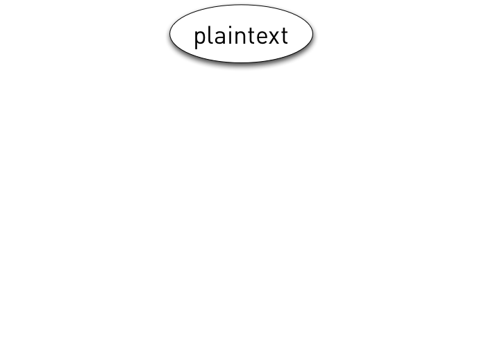
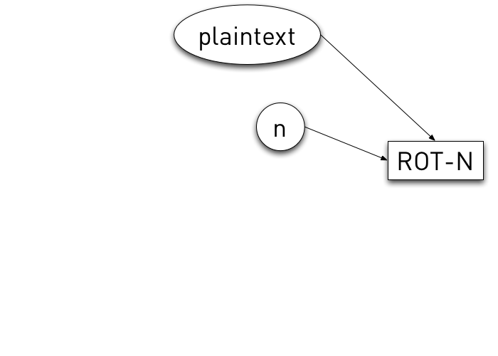
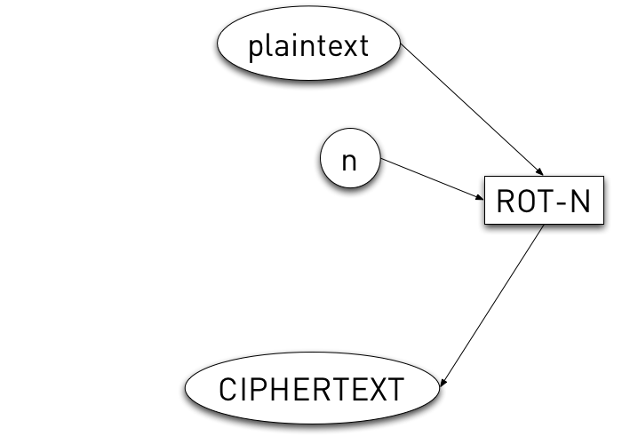
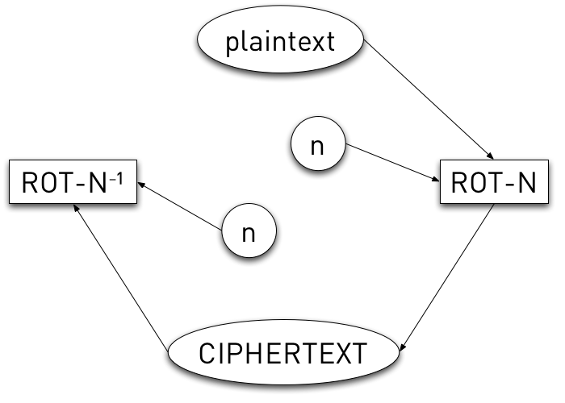
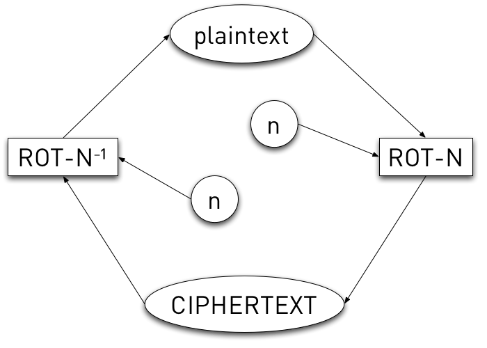

!SLIDE

# ROT-N #

!SLIDE

# ROT-N #

!SLIDE

# ROT-N #

!SLIDE

# ROT-N #

!SLIDE

# ROT-N #

!SLIDE

# ROT13 == ROT13-1 #

!SLIDE bullets incremental

# ROT-N Vulnerabilities #

* Brute force (25 combinations)
* alphabetic only
