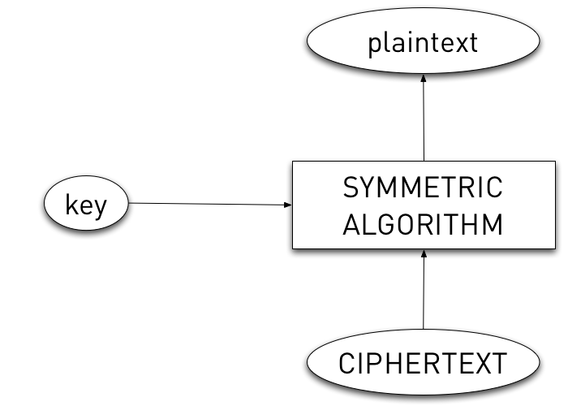
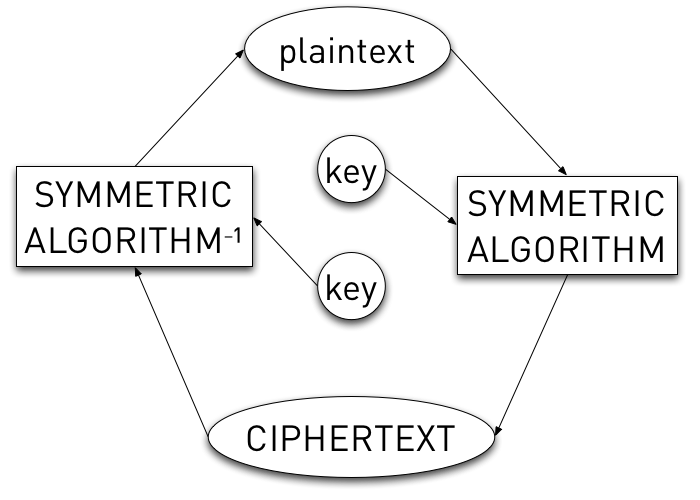

!SLIDE
# Real Symmetric Cryptography #

.notes Confusion, Diffusion, secret key

!SLIDE bullets incremental
# Real Symmetric Cryptography #

* Confusion
* Diffusion
* PUBLIC ALGO, secret key
* Operates on a single block size

!SLIDE center
# Real Symmetric Encryption #

!SLIDE center
# Real Symmetric Decryption #

!SLIDE center
# Wait a minute... #

!SLIDE center
# Real Symmetric Cryptography #

!SLIDE bullets incremental
# Real Symmetric Cryptography #

* DES
* 3DES
* AES (Rijndael)

!SLIDE bullets incremental
# DES #

* Published 1977/79
* 56-bit key
* 64-bit block size

!SLIDE bullets incremental
# Triple DES (3DES) #

* Published 1998
* 168-bit key (generally)
* 64-bit block size
* CIPHERTEXT = Ek3(Dk2(Ek1(plaintext)))
