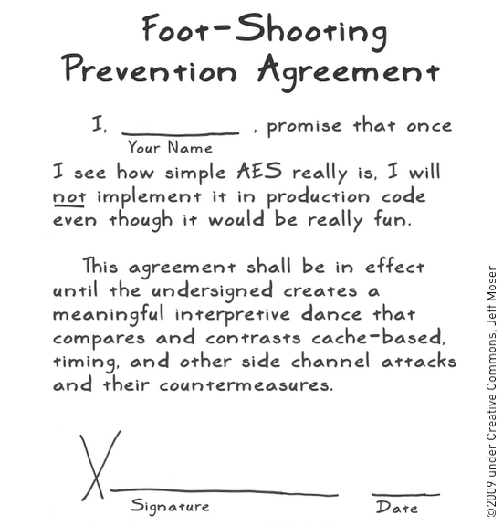
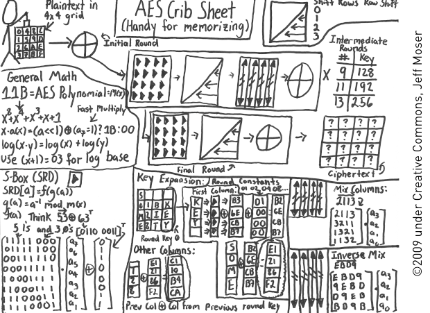

!SLIDE
# AES #

!SLIDE
# but first... #

!SLIDE

!SLIDE
# QR Code available later #

!SLIDE bullets incremental
# AES #

* Rijmen + Daemen = "Rijndael"
* Published 1998, Annointed 2001
* 128-bit block
* 128-, 192-, or 256-bit key

!SLIDE bullets incremental
# AES Vulnerabilities #
## (key recovery) ##

* eXtended Sparse Linearization (not yet proven)
* Related Key Attacks on 256-bit AES (14 rounds)
* Biclique Cryptanalysis (factor of ~4)
* Side-Channel (as low as 800 ops)

!SLIDE bullets incremental
# AES Operation #

* XOR with round key (s-box confusion)
* Shift rows (diffusion)
* Mix columns (MOAR diffusion!)
* Repeat (10, 12, or 14 rounds)

!SLIDE

