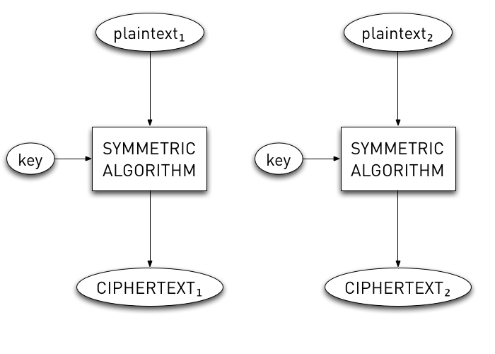

!SLIDE
# \*Shrug\* #
## How about ecb? ##

!SLIDE
# FAIL! #

!SLIDE center
# Electronic Codebook (ECB) #

!SLIDE bullets incremental
# ECB Vulnerabilities #

* Information Leakage
* Pattern Analysis

!SLIDE code smbullets
# Information Leakage #

* msg = "The weather is: sunnyEOM"
* out = "123456781234567812345678"
* msg = "The weather is: rainyEOM"
* out = "1234567812345678jdu8xv,9"

!SLIDE
# Pattern Analysis #

