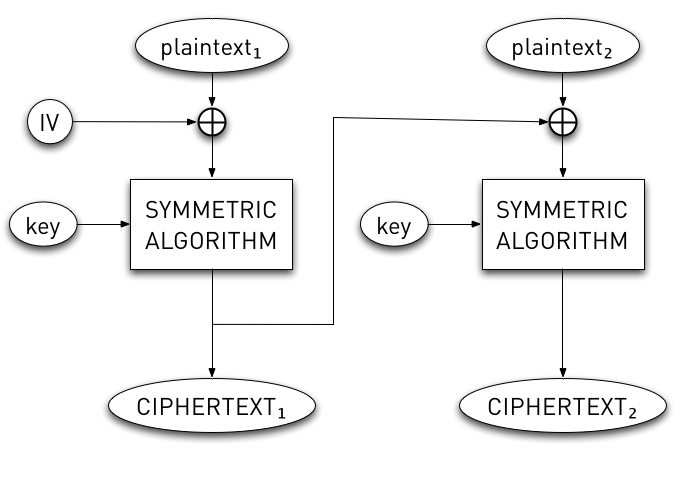

!SLIDE bullets incremental
# Chain-Block Cipher #

* Each block depends on previous block
* First block depends on INITIALIZATION VECTOR

!SLIDE center
# Chain-Block Cipher #

!SLIDE bullets incremental
# CBC Vulnerabilities #

* PEBKAC

!SLIDE code smbullets

* IV  = "some IV"
* msg = "The weather is: sunnyEOM"
* out = "123456781234567812345678"
* IV  = "some IV"
* msg = "The weather is: rainyEOM"
* out = "1234567812345678`kjzu9)j"

!SLIDE code smbullets

* IV  = "some random IV"
* msg = "The weather is: sunnyEOM"
* out = "123456781234567812345678"
* IV  = "some other random IV"
* msg = "The weather is: rainyEOM"
* out = "4_89b$kbsd,j\xk `kjzu9)j"

!SLIDE center
# Pattern Analysis #

!SLIDE
# MORAL #
## do not drop down to this level ##

!SLIDE
# BUT #
## If you have to, use ##
# AES-n-CBC #
